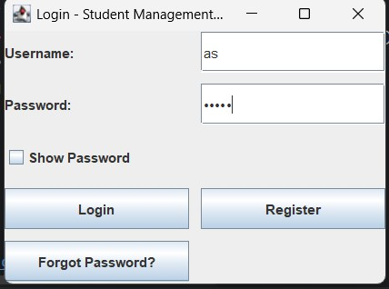

# 🧑‍🎓 Student Management System 

A simple desktop-based application that lets users manage student records using Java Swing GUI.

## 🚀 Features

- ✅ Add / View / Update / Delete students
- 🔐 Login system with secure password check
- 📝 Register new users (stored in `users.txt`)
- 👁️ Show/Hide password option
- 📁 File-based user authentication

---

### 🔐 Login Screen

### 📝 Student Management GUI

### 📝 Student Details Added

        ---

        ## 📁 Project Structure

Student-Management-System/
├── src/
│ ├── LoginScreen.java
│ ├── RegisterScreen.java
│ ├── Student.java
│ └── StudentManagementGUI.java
├── users.txt ← stores user credentials
├── README.md
└── images/
├── login.png
└── main_gui.png

